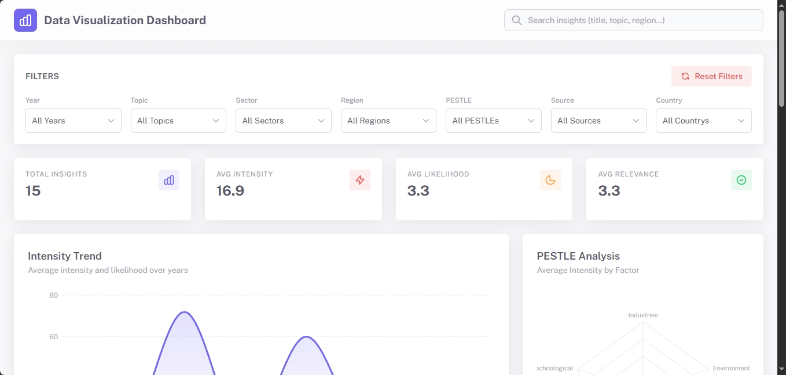
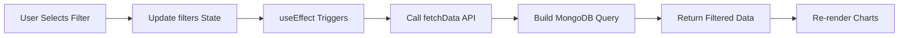
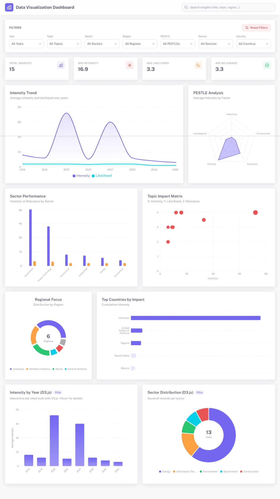

# 📊 Data Visualization Dashboard

<div align="center">



[](https://reactjs.org/)
[](https://www.typescriptlang.org/)
[](https://nodejs.org/)
[](https://www.mongodb.com/)
[](https://d3js.org/)
[](https://recharts.org/)

**A modern, responsive MERN stack dashboard featuring interactive data visualizations with D3.js and Recharts**

[Features](#-features) • [Quick Start](#-quick-start) • [API Documentation](#-api-documentation) • [Tech Stack](#-tech-stack) • [Deployment](#-deployment)

</div>

---

## ✨ Features

### 🎨 **Rich Visualizations**
- **8 Interactive Charts** including Area, Bar, Radar, Scatter, Pie, and custom D3.js visualizations
- **Real-time Filtering** with 9+ dynamic filter options
- **Full-text Search** across multiple data fields
- **Responsive Design** optimized for desktop, tablet, and mobile devices

### 📈 **Chart Types**
| Chart | Library | Purpose |
|-------|---------|---------|
| **Area Chart** | Recharts | Intensity & Likelihood trends over time |
| **Bar Chart** | Recharts | Sector Performance (Intensity vs Relevance) |
| **Radar Chart** | Recharts | PESTLE Analysis visualization |
| **Scatter Chart** | Recharts | Topic Impact Matrix |
| **Pie Chart** | Recharts | Regional Focus distribution |
| **Horizontal Bar** | Recharts | Top Countries by Impact |
| **D3 Bar Chart** | D3.js | Custom Intensity by Year visualization |
| **D3 Pie Chart** | D3.js | Interactive Sector Distribution |

### 📊 **KPI Metrics**
- Total Insights Count
- Average Intensity Score
- Average Likelihood Score
- Average Relevance Score

### 🔍 **Advanced Filtering**
- End Year
- Topic
- Sector
- Region
- PESTLE Category
- Source
- SWOT Analysis
- Country
- City
- Full-text Search

### 🚀 **Technical Highlights**
- **Frontend**: React 19 with TypeScript and Vite for blazing-fast development
- **Backend**: RESTful API with Express.js and MongoDB
- **Data Processing**: Automatic data cleaning and type conversion
- **Performance**: Indexed MongoDB fields for optimized queries
- **State Management**: React hooks (useState, useEffect)
- **Styling**: Tailwind CSS for modern, utility-first design

---

## 🚀 Quick Start

### Prerequisites

Ensure you have the following installed:
- **Node.js** >= 18.x
- **MongoDB** (local installation or Atlas account)
- **npm** or **yarn**

### Installation

#### 1️⃣ Clone the Repository

```bash
git clone <repository-url>
cd Data-Visualization-Dashboard
```

#### 2️⃣ Install Frontend Dependencies

```bash
npm install
```

#### 3️⃣ Install Backend Dependencies

```bash
cd server
npm install
```

#### 4️⃣ Configure Environment Variables

Create a `.env` file in the `/server` directory:

```env
PORT=5000
MONGODB_URI=mongodb://localhost:27017/visualization_dashboard
```

For **MongoDB Atlas**, use:
```env
MONGODB_URI=mongodb+srv://<username>:<password>@cluster0.xxxxx.mongodb.net/visualization_dashboard?retryWrites=true&w=majority
```

#### 5️⃣ Seed the Database

**⚠️ CRITICAL STEP** - This populates your database with the required data:

```bash
cd server
node seed.js
```

**Verification**: Open MongoDB Compass and verify that `intensity`, `likelihood`, and `relevance` fields are stored as **Int32** (not String). If they're strings, charts will fail to aggregate data properly.

#### 6️⃣ Start the Backend Server

```bash
cd server
npm run dev  # Development mode with auto-reload
# OR
npm start    # Production mode
```

The API will be available at `http://localhost:5000`

#### 7️⃣ Enable Backend API in Frontend

Edit `services/dataService.ts`:

```typescript
const USE_BACKEND_API = true; // Change from false to true
```

#### 8️⃣ Start the Frontend Development Server

```bash
# From the root directory
npm run dev
```

Open your browser and navigate to `http://localhost:3000`

---

## 📁 Project Structure

```
Data-Visualization-Dashboard/
│
├── 📂 server/                      # Backend API
│   ├── 📂 models/
│   │   └── Data.js                # Mongoose Schema with validation
│   ├── 📂 routes/
│   │   └── api.js                 # RESTful API endpoints
│   ├── index.js                   # Express server configuration
│   ├── seed.js                    # Database seeding script
│   ├── package.json
│   └── .env                       # Environment variables
│
├── 📂 components/                  # React Components
│   ├── Dashboard.tsx              # Main dashboard container
│   ├── FilterBar.tsx              # Dynamic filter controls
│   ├── D3BarChart.tsx             # Custom D3.js Bar Chart
│   ├── D3PieChart.tsx             # Custom D3.js Pie Chart
│   └── Navbar.tsx                 # Navigation with search
│
├── 📂 services/
│   └── dataService.ts             # API client (supports API & local mode)
│
├── 📂 data/
│   └── rawData.ts                 # Sample data for frontend-only mode
│
├── 📂 docs/
│   ├── Dashboard.png              # Dashboard screenshot
│   └── complete_dashboard.jpeg    # Full dashboard view
│
├── types.ts                       # TypeScript type definitions
├── App.tsx                        # Root application component
├── index.tsx                      # Application entry point
├── index.html                     # HTML template
├── package.json                   # Frontend dependencies
├── vite.config.ts                 # Vite configuration
├── tsconfig.json                  # TypeScript configuration
└── jsondata.json                  # Source data file
```

---

## 🔌 API Documentation

### Base URL
```
http://localhost:5000
```

### Endpoints

#### **GET** `/api/data`
Fetch filtered data from MongoDB with dynamic query building.

**Query Parameters:**

| Parameter | Type | Description | Example |
|-----------|------|-------------|---------|
| `end_year` | Number | Filter by end year | `2030` |
| `topic` | String | Filter by topic | `oil` |
| `sector` | String | Filter by sector | `Energy` |
| `region` | String | Filter by region | `Northern America` |
| `pestle` | String | Filter by PESTLE category | `Economic` |
| `source` | String | Filter by source | `EIA` |
| `swot` | String | Filter by SWOT category | `Strength` |
| `country` | String | Filter by country | `United States of America` |
| `city` | String | Filter by city | `Washington` |
| `search` | String | Full-text search | `energy crisis` |
| `limit` | Number | Limit results | `100` |
| `skip` | Number | Skip records (pagination) | `0` |

**Example Request:**
```bash
GET /api/data?sector=Energy&region=Northern%20America&end_year=2030
```

**Example Response:**
```json
[
  {
    "_id": "507f1f77bcf86cd799439011",
    "end_year": 2030,
    "intensity": 6,
    "sector": "Energy",
    "topic": "oil",
    "insight": "...",
    "url": "...",
    "region": "Northern America",
    "start_year": 2020,
    "impact": "",
    "added": "January, 20 2017 03:51:25",
    "published": "January, 09 2017 00:00:00",
    "country": "United States of America",
    "relevance": 2,
    "pestle": "Economic",
    "source": "EIA",
    "title": "...",
    "likelihood": 3
  }
]
```

#### **GET** `/api/filters`
Get unique values for all filter dropdowns.

**Response:**
```json
{
  "end_years": [2020, 2025, 2030, ...],
  "topics": ["oil", "gas", "consumption", ...],
  "sectors": ["Energy", "Government", ...],
  "regions": ["Northern America", "Central America", ...],
  "pestles": ["Economic", "Environmental", ...],
  "sources": ["EIA", "OIES", ...],
  "swots": ["Strength", "Weakness", ...],
  "countries": ["United States of America", ...],
  "cities": ["Washington", "London", ...]
}
```

#### **GET** `/api/stats`
Get aggregated statistics and distributions.

**Response:**
```json
{
  "total": 1000,
  "avgIntensity": 6.5,
  "avgLikelihood": 2.8,
  "avgRelevance": 3.2,
  "distributions": { ... }
}
```

#### **GET** `/health`
Health check endpoint.

**Response:**
```json
{
  "status": "OK",
  "timestamp": "2026-01-09T11:01:59.000Z"
}
```

---

## 🎯 Filter Logic Flow



**Implementation:**
```tsx
// Dashboard.tsx
useEffect(() => {
  const loadData = async () => {
    const result = await fetchData({ ...filters, search: searchTerm });
    setData(result);
  };
  loadData();
}, [filters, searchTerm]); // Re-runs when filters change
```

---

## 🛠️ Tech Stack

<div align="center">

| Category | Technologies |
|----------|-------------|
| **Frontend** | React 19, TypeScript, Vite |
| **Styling** | Tailwind CSS |
| **Charts** | Recharts 3.5, D3.js 7.8 |
| **Backend** | Node.js, Express.js |
| **Database** | MongoDB, Mongoose ODM |
| **State Management** | React Hooks (useState, useEffect) |
| **Build Tool** | Vite 6.2 |
| **Type Safety** | TypeScript 5.8 |

</div>

---

## ⚠️ Troubleshooting

### Charts Show 0 or Fail to Render

**Cause:** Numeric fields (`intensity`, `likelihood`, `relevance`) stored as strings instead of numbers.

**Solution:**
1. Re-run the seed script: `node seed.js`
2. Verify in MongoDB Compass that fields are **Int32** type
3. If still strings, manually convert or update the seed script

### CORS Errors

**Cause:** Backend not allowing frontend origin.

**Solution:** Backend is pre-configured for `localhost:3000`. If using a different port, update CORS settings in `server/index.js`:

```javascript
app.use(cors({
  origin: 'http://localhost:YOUR_PORT'
}));
```

### API Returns Empty Array

**Cause:** Database not seeded or connection issues.

**Solution:**
1. Verify MongoDB is running: `mongosh`
2. Check database exists: `show dbs`
3. Re-run seed script: `node seed.js`
4. Verify `.env` connection string

### Frontend Shows No Data

**Cause:** `USE_BACKEND_API` flag is set to `false`.

**Solution:** Edit `services/dataService.ts` and set:
```typescript
const USE_BACKEND_API = true;
```

---

## ☁️ Deployment

### Deploy Backend to Railway/Render

1. **Create Account** on [Railway](https://railway.app/) or [Render](https://render.com/)
2. **Connect GitHub Repository**
3. **Set Environment Variables:**
   ```env
   PORT=5000
   MONGODB_URI=<your-atlas-connection-string>
   ```
4. **Deploy** and note the backend URL

### Deploy Frontend to Vercel/Netlify

1. **Update API URL** in `services/dataService.ts`:
   ```typescript
   const API_BASE_URL = 'https://your-backend-url.com';
   ```
2. **Build the project:**
   ```bash
   npm run build
   ```
3. **Deploy** to [Vercel](https://vercel.com/) or [Netlify](https://www.netlify.com/)

### MongoDB Atlas Setup

1. **Create Account** at [MongoDB Atlas](https://www.mongodb.com/cloud/atlas)
2. **Create Free Cluster** (M0 Tier)
3. **Configure Network Access:**
   - Add IP: `0.0.0.0/0` (development) or specific IPs (production)
4. **Create Database User:**
   - Username and password for authentication
5. **Get Connection String:**
   - Click **Connect** → **Connect your application**
   - Copy connection string
6. **Update `.env`:**
   ```env
   MONGODB_URI=mongodb+srv://<username>:<password>@cluster0.xxxxx.mongodb.net/visualization_dashboard?retryWrites=true&w=majority
   ```
7. **Seed Database:**
   ```bash
   cd server
   node seed.js
   ```

---

## 📋 Assignment Requirements Checklist

- [x] Mongoose Schema with proper data types
- [x] Data cleaning script (empty strings → null/numbers)
- [x] RESTful API with dynamic filtering
- [x] 9+ filter options (end_year, topic, sector, region, pestle, source, swot, country, city)
- [x] React 19 frontend with TypeScript
- [x] Vite build tool
- [x] Tailwind CSS styling
- [x] useState and useEffect for state management
- [x] Multiple chart types (Bar, Pie, Area, Radar, Scatter)
- [x] D3.js custom visualizations
- [x] Recharts integration
- [x] KPI cards with aggregated metrics
- [x] Top navigation bar with search
- [x] Filter bar with dynamic dropdowns
- [x] Responsive design
- [x] Full-text search functionality

---

## 📸 Screenshots

<div align="center">

### Full Dashboard View


</div>

---

## 🤝 Contributing

Contributions, issues, and feature requests are welcome! Feel free to check the issues page.

1. Fork the repository
2. Create your feature branch (`git checkout -b feature/AmazingFeature`)
3. Commit your changes (`git commit -m 'Add some AmazingFeature'`)
4. Push to the branch (`git push origin feature/AmazingFeature`)
5. Open a Pull Request

---

## 📝 License

This project is open source and available under the [MIT License](LICENSE).

---

## 👨‍💻 Developer

<div align="center">

**Karan Soni**

[](mailto:Karankumarsoni.r@gmail.com)
[](https://github.com/karankumarsoni)
[](https://linkedin.com/in/karankumarsoni)

</div>

---

<div align="center">

**⭐ Star this repository if you find it helpful!**

Made with ❤️ by Karan Soni

</div>